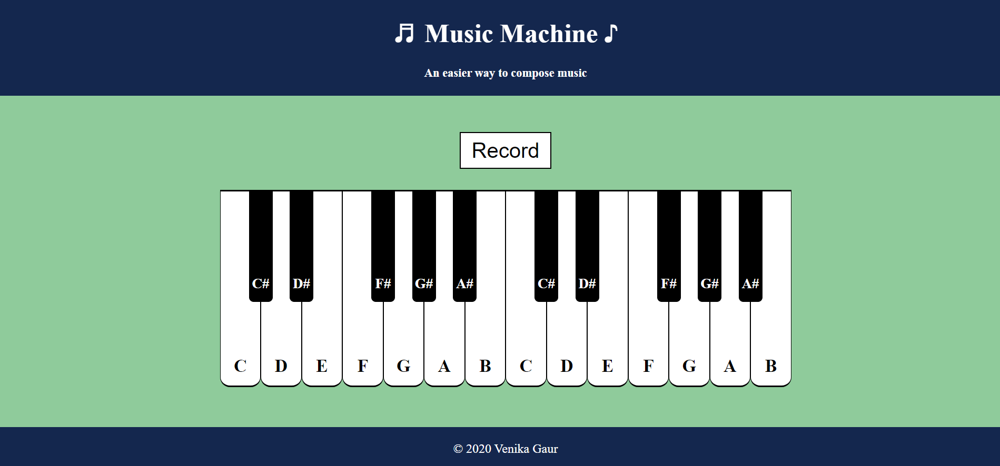
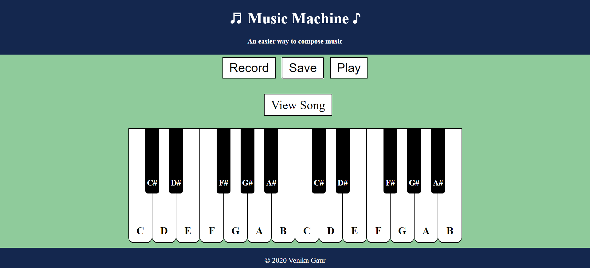

# Music_machine
Music Machine allows users to play Piano from the comfort of their 'keyboard'. Users can click on the Piano keys displayed on the screen or press the alphabet keys on their computer to play a tune. Each keyboard key is mapped to a specific Piano key. Users can also play back the tune they just made and if they like it, save it to the database. Users can then share the link of their tune with their friends and family! If they want to re-record themselves, they can get back and start all over again.

# Development
I started with building a simple piano model in HTML and CSS and added the music tunes by using Javascript to map keys. Next, I decided to add the functionality of letting users store the tunes that they make by using Express JS and Mongo DB to create the backend for the project. After that, I decided to move the database from my local machine to the cloud by using Google Cloud services.

# Demo
To try the piano, just visit this link- https://music--machine.herokuapp.com/
# Screenshots
  
       
       
  

# Future updates
I would like to add more instruments to the music machine. Perhaps, a feature that will allow users to switch between different instruments while composing. Also, the functionality of creating a user account and store the composed melodies.

# Changes
I moved the application from Google Cloud to Heroku with MongoDB Atlas because I ran out of credit on my GC.

# Helpful links
- https://cloud.google.com/sdk/docs/install
- https://docs.mongodb.com/guides/
- https://developer.mongodb.com/how-to/use-atlas-on-heroku
